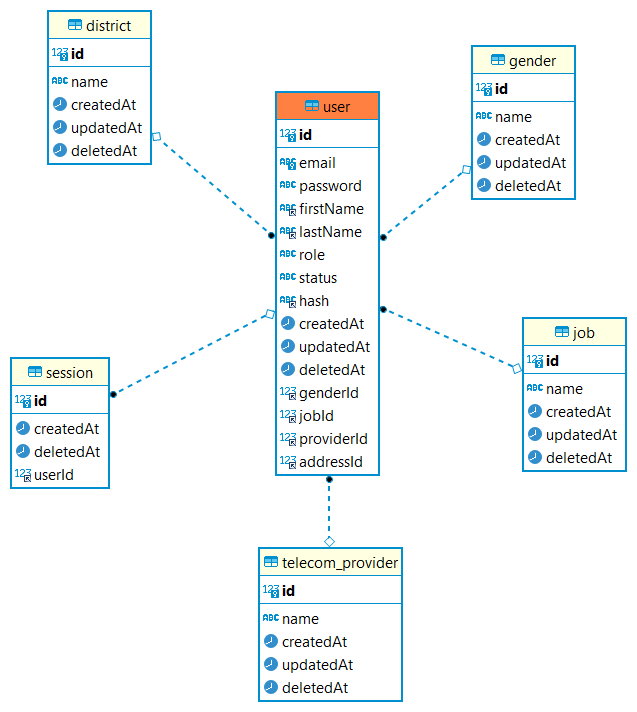

# Database - TypeORM
Ứng dụng PSE dùng để tra cứu dữ liệu của những khách hàng sử dụng dịch vụ dịch vụ viễn thông. Các thông tin của khách hàng bao gồm địa chỉ, công việc, giới tính. Từ đó có thể có một cái nhìn thổng quan về tệp khách hàng của các nhà mạng.
- Trong project cho tuần thực tập đầu tiên này sử dụng TypeORM, một thư viện ORM (object relational mapping) nổi tiếng trên nền tảng JS.

## Database
- Ứng dụng PSE sử dụng một cơ sở dữ liệu đơn giản bao gồm 7 bảng:

    
- Trong đó `address`, `job`, `telecom_provider`, `gender` là những thông tin xoay quanh người dùng. Mục đích để dữ liệu được sinh động hơn.
1. Address:
- Là bảng dùng để lưu trữ dữ địa chỉ khách hàng, các giá trị ban đầu khi được seeding sẽ bao gồm các quận huyện của thành phố HCM.
```ts
[
  {
    id: 1,
    name: 'District 1',
  },
  {
    id: 2,
    name: 'District 2',
  },
  {
    id: 3,
    name: 'District 3',
  },
  {
    id: 4,
    name: 'District 4',
  },
]
```
2. Gender
- Lưu trữ thông tin giới tính
```ts
[
  {
    id: 1,
    name: 'Male',
  },
  {
    id: 2,
    name: 'Female',
  },
  {
    id: 3,
    name: 'Custom',
  },
]
```
3. Job
- Lưu trữ thông tin công việc
```ts
[
  {
    id: 1,
    name: 'IT',
  },
  {
    id: 2,
    name: 'HR',
  },
  {
    id: 3,
    name: 'Marketing',
  },
]
```
4. Telecom provider
- Lưu trữ thông tin nhà cung cấp dịch vụ viễn thông
```ts
[
  {
    id: 1,
    name: 'VINAPHONE',
  },
  {
    id: 2,
    name: 'VIETTEL',
  },
  {
    id: 3,
    name: 'VIETNAMMOBILE',
  },
]
```
5. User
- Lưu trữ thông tin người dùng.


> **Note**: Ngoài dữ liệu mẫu ra, một số api bằng `Restful` và `Graphql` đã được viết để có thể thêm và sửa đổi dữ liệu.

## TypeORM
- TypeORM hỗ trợ mạnh mẽ và tương thích với nhiều hệ quản trị cơ sở dữ liệu khác nhau trên Nodejs.
- Trong project tự học này sử dụng `Mysql`.

### Cấu hình
- TypeORM cung cấp lớp `DataSource` để hỗ trợ khai báo các giá trị kết nối, cấu hình database:
```ts
export const AppDataSource = new DataSource({
  type: 'mysql',
  url: databaseUrl,
  host: databaseHost,
  port: databasePort,
  username: databaseUsername,
  password: databasePassword,
  database: databaseName,
  synchronize: process.env.DATABASE_SYNCHRONIZE === 'true',
  dropSchema: false,
  keepConnectionAlive: true,
  logging: process.env.LOG_MODE == 'true',
  entities: [__dirname + '/../**/*.entity{.ts,.js}'],
  migrations: [__dirname + '/migrations/**/*{.ts,.js}'],
  cli: {
    entitiesDir: 'src',
    migrationsDir: 'src/database/migrations',
    subscribersDir: 'subscriber',
  },
} as DataSourceOptions);
```

> Note: Các giá trị trên không nên truyền trực tiếp vào lúc khởi tạo đối tượng `AppDataSource`. Mà tốt nhất nên đi qua một lớp validate các biến môi trường trước khi chúng được đem đi sử dụng.

1. Validate biến môi trường
```ts
import {
  IsOptional,
  IsInt,
  Min,
  Max,
  IsString,
  ValidateIf,
  IsBoolean,
} from 'class-validator';

class EnvironmentVariablesValidator {
  @ValidateIf((envValues) => !envValues.DATABASE_URL)
  @IsString()
  DATABASE_HOST: string;

  @ValidateIf((envValues) => !envValues.DATABASE_URL)
  @IsInt()
  @Min(0)
  @Max(65535)
  @IsOptional()
  DATABASE_PORT: number;

  @ValidateIf((envValues) => !envValues.DATABASE_URL)
  @IsString()
  @IsOptional()
  DATABASE_PASSWORD: string;

  @ValidateIf((envValues) => !envValues.DATABASE_URL)
  @IsString()
  DATABASE_NAME: string;

  @ValidateIf((envValues) => !envValues.DATABASE_URL)
  @IsString()
  DATABASE_USERNAME: string;
}
```
- Thư viện `class-validator` cung cấp các decorator để làm việc này một cách dễ dàng.
2. Khai báo các lớp trên vào AppModule
- AppModule dùng để khai báo tất cả những sub module cần thiết để khởi động ứng dụng trong nestjs. Để TypeORM hoạt động được thì chúng ta cần hai thành phần chính:
    - Config: config đã được khai báo và validate ở trên
    - TypeOrmModule

    ```ts
    import { Module } from '@nestjs/common';
    import databaseConfig from './config/database.config';
    import { ConfigModule } from '@nestjs/config';
    import { TypeOrmModule } from '@nestjs/typeorm';
    import { TypeOrmConfigService } from './database/typeorm-config.service';
    import { DataSource, DataSourceOptions } from 'typeorm';

    @Module({
    imports: [
        ConfigModule.forRoot({
            isGlobal: true,
            load: [databaseConfig],
            envFilePath: ['.env'],
        }),
        TypeOrmModule.forRootAsync({
            useClass: TypeOrmConfigService,
            dataSourceFactory: async (options: DataSourceOptions) => {
                return new DataSource(options).initialize();
            },
        }),
    ],
    })
    export class AppModule {}
    ```

- Tất cả các thành phần của ứng dụng phải được khai báo trong phần thân của decorator `@Mudule`.
- Như vậy quá trình cấu hình `TypeORM` đã được trình bày như trên, tiếp theo chúng ta sẽ cần thêm một số chức năng như tạo bảng từ các Entities, seeding dữ liệu.

### Entity
- Khi sử dụng TypeORM, các entity là nơi để định nghĩa các logic, từ kiểu dữ liệu, ràng buộc, trigger và produce. Từ đó TypeORM có thể chuyển đổi các logic này sang các câu lệnh sinh bảng trong cơ sở dữ liệu.
1. Entity
- Entity dùng để mô tả một thực thể từ bên ngoài lên môi trường lập trình, sau đây là ví dụ về entity dùng đê mô tả giới tính (ví dụ từ trong project):
```ts
import {
  Column,
  Entity,
  PrimaryGeneratedColumn,
  DeleteDateColumn,
  Generated,
} from 'typeorm';
import { ApiProperty } from '@nestjs/swagger';
import { EntityHelper } from '../../utils/entity-helper';

@ObjectType({ description: 'gender' })
@Entity()
export class Gender extends EntityHelper {
  @ApiProperty({ example: 1 })
  @PrimaryGeneratedColumn()
  @Generated('increment')
  id: number;

  @ApiProperty({ name: 'Male' })
  @Column({ type: 'varchar', nullable: true })
  name: string | null;

  @Column({
    type: 'timestamp',
    default: () => 'CURRENT_TIMESTAMP',
  })
  createdAt: Date;

  @Column({
    type: 'timestamp',
    default: () => 'CURRENT_TIMESTAMP',
    onUpdate: 'CURRENT_TIMESTAMP',
  })
  updatedAt: Date;

  @DeleteDateColumn({
    type: 'timestamp',
    nullable: true,
  })
  deletedAt: Date;
}
``` 

- TypeORM cung cấp các decorator thuận tiện trong việc khai báo các trường:
    - `@Column()`: đánh một trường trong lớp `Gender` sẽ được mapping vào database.
    - ` @PrimaryGeneratedColumn()`: đánh dấu khóa chính.
    - `@DeleteDateColumn()`: đánh giấu một cột được sử dụng trong trường hợp record này bị xóa khỏi db.

### Migrate & seeding dữ liệu
Migrate và seeding sẽ không chạy trên luồng chính của ứng dụng, mà chạy qua một script bằng typeorm:
- Script: định nghĩa môi trường, cấu hình cơ sở dữ liệu, vẫn dùng lớp `DataSource` giống khai báo ở trên.
- typeorm: cli được phát triển cho mục đích chuyên biệt là thực thi các hành động migrate & seeding độc lập với luồng thực thi chính của ứng dụng.

1. Script
```ts
import 'reflect-metadata';
import { DataSource, DataSourceOptions } from 'typeorm';

const isTestEnvironment = process.env.NODE_ENV == 'test';

const databaseUrl = isTestEnvironment
  ? process.env.TEST_DATABASE_URL
  : process.env.DATABASE_URL;
// ...

export const AppDataSource = new DataSource({
  ...
  logging: process.env.LOG_MODE == 'true',
  entities: [__dirname + '/../**/*.entity{.ts,.js}'],
  migrations: [__dirname + '/migrations/**/*{.ts,.js}'],
  cli: {
    entitiesDir: 'src',
    migrationsDir: 'src/database/migrations',
    subscribersDir: 'subscriber',
  },
} as DataSourceOptions);

```
- Các regex được sử dụng để mô tả địa chỉ của các entity: `/../**/*.entity{.ts,.js}`.
- Thư mục dùng để lưu trữ các file migrations được người dùng quy định, ở trong project này chúng được lưu trữ trong `src/database/migrations`:

    | ID | Migration Name |
    | -------- | -------- |
    | 1688695206111 | InitDatabase |
    | 1688695637624 | UpdateGender |

    - ID: dùng để đánh số cho các phiên bản migrations, giá trị của những số này tương ứng với thời gian migration được cập nhật.
    - Migration Name: tên của các bản cập nhật.
    - Khi dùng typeorm cli để chạy các bản migrations này, thứ tự được chạy sẽ là từ trên xuống dưới, tất cả các bản cập nhật đều được chạy qua. Lịch sử phiên bản sẽ được lưu trữ trong cơ sở dữ liệu tự động.
2. typeorm cli
```json
"typeorm": "env-cmd ts-node -r tsconfig-paths/register ./node_modules/typeorm/cli.js"
```

- Để có thể dùng typeorm cli, chúng ta cần tải về, có hai lựa chọn là lưu trữ cục bộ trong thư mục `node_modules` và lưu trữ trên môi trường của máy.
```bash
npm install ts-node --save-dev
```

Trong project này đã cấu hình những scripts cần thiết để có thể chạy migration, rollback dựa trên môi trường:
```json
"migration:generate": "npm run typeorm -- --dataSource=src/database/data-source.ts migration:generate",
"migration:create": "npm run typeorm -- migration:create",
"migration:run": "npm run typeorm -- --dataSource=src/database/data-source.ts migration:run",
"migration:run:test": "NODE_ENV=test npm run typeorm -- --dataSource=src/database/data-source.ts migration:run",
"migration:revert": "npm run typeorm -- --dataSource=src/database/data-source.ts migration:revert",
"migration:revert:test": "NODE_ENV=test npm run typeorm -- --dataSource=src/database/data-source.ts migration:revert",
```


