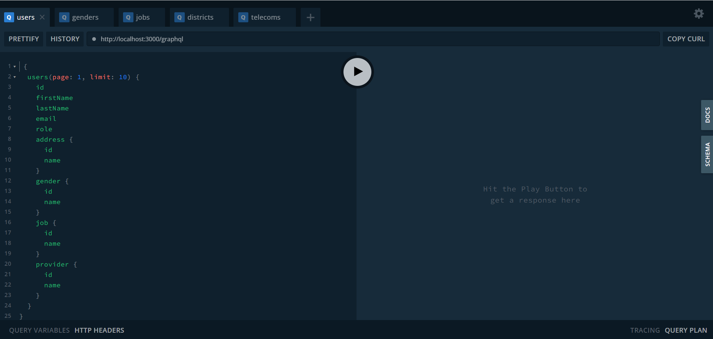
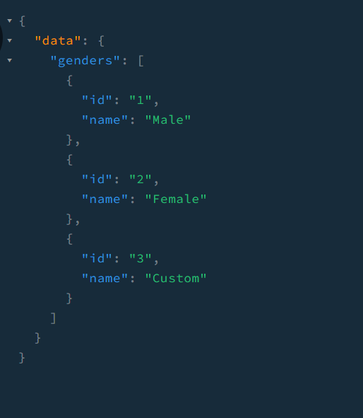

# Graphql
GraphQL là một ngôn ngữ truy vấn và một cách tiếp cận mới trong việc thiết kế và truy xuất dữ liệu từ các API.

Với GraphQL, có thể xác định những truy vấn cụ thể để lấy chính xác dữ liệu theo yêu cầu, GraphQL được sử dụng cho các cơ sở dữ liệu lớn, trong đó có các thao tác truy vấn phức tạp mà Restful api không đáp ứng tốt.
## Apollo
Apollo Server là một thư viện phát triển máy chủ GraphQL dựa trên JavaScript. Nó cung cấp các công cụ và tính năng mạnh mẽ để xây dựng, triển khai và quản lý máy chủ GraphQL.

Apollo Server hỗ trợ các tính năng quan trọng của GraphQL như truy vấn (query), ghi (mutation) và đăng ký (subscription). Nó cung cấp cơ chế mạnh mẽ để xử lý logic của các truy vấn và mutation thông qua các hàm được gọi là resolvers.

1. Tích hợp Apollo
- Chúng ta phải khai báo vào trong decorator @Module trong app.module trước khi sử dụng.
```ts
// ...
import { GraphQLModule } from '@nestjs/graphql';
import { ApolloDriver, ApolloDriverConfig } from '@nestjs/apollo';

@Module({
  imports: [
    // ...
    GraphQLModule.forRoot<ApolloDriverConfig>({
      driver: ApolloDriver,
      autoSchemaFile: 'schema.gql',
      installSubscriptionHandlers: true,
    }),
    GenderModule,
  ],
})
export class AppModule {}
```
- Đối với đoạn code trên, khi khởi động ứng dụng, một file `schema.gql` sẽ được tự động sinh ra dựa vào các decorator trên Entities.
## Entity
Để triển khai GraphQL trong ứng dụng PSE, chúng ta phải khai báo các trường dữ liệu nhằm mục đính tạo schema khi server được khởi chạy.

1. @nestjs/graphql
- `@nestjs/graphql` cung cấp các decorator dùng để đánh dấu các trường dữ liệu được được dùng trong graphql.
Trong ví dụ này chúng ta tiếp tục sử dụng Entity Gender như ở phần trước:
```ts
import {
  Column,
  Entity,
  PrimaryGeneratedColumn,
  DeleteDateColumn,
  Generated,
} from 'typeorm';
import { Field, ID, ObjectType } from '@nestjs/graphql';

@ObjectType({ description: 'gender' })
@Entity()
export class Gender extends EntityHelper {
  @ApiProperty({ example: 1 })
  @Field(() => ID)
  @PrimaryGeneratedColumn()
  @Generated('increment')
  id: number;

  @ApiProperty({ name: 'Male' })
  @Field({ nullable: true })
  @Column({ type: 'varchar', nullable: true })
  name: string | null;
  //...
}
```
Trong đó: 
- `@ObjectType` đánh dấu các Entity được dùng trong graphql.
- `@Field` đánh dấu các trường được mapping vào graphql.
- `ID` đánh dấu khóa chính.

## Resolver
- Resolver là một lớp có các phương thức được định nghĩa để xử lý logic cho mỗi trường trong một schema GraphQL. Khi một truy vấn GraphQL được gọi, resolver sẽ được gọi tương ứng với mỗi trường được yêu cầu trong truy vấn đó.
```ts
// ...
import { Args, Mutation, Query, Resolver, Subscription } from '@nestjs/graphql';

@Resolver((of) => Gender)
export class GendersResolver {
  constructor(private readonly gendersService: GendersService) {}

  @Query((returns) => Gender)
  async gender(@Args('id') id: number): Promise<Gender> {
    const gender = await this.gendersService.findOne({ id: id });
    if (!gender) {
      throw new NotFoundException(id);
    }
    return gender;
  }

  @Mutation((returns) => Boolean)
  async removeGender(@Args('id') id: number) {
    return this.gendersService.softDelete(id);
  }
}
```
Trong đó: 
- `@Resolver` được dùng để đánh dấu các resolver.
- `@Query` được dùng để đánh dấu các thao tác truy vấn.
- `@Mutation` được dùng để đánh dấu các thao tác ghi.

## Schema.gql
- Đây là cấu trúc truy vấn được tự động sinh ra từ Entity Gender
```gql
"""gender"""
type Gender {
  id: ID!
  name: String
  createdAt: DateTime!
  updatedAt: DateTime!
  deletedAt: DateTime!
}
```

## Truy vấn
1. Khởi động server
- Apollo sẽ tự động đăng ký 1 route `/graphql` để người dùng có thể truy cập trực tiếp từ browser.

  

2. Thực hiện truy vấn
- Chúng ta sẽ thử một truy vấn cho các dữ liệu về genders:
```gql
 {
  genders {
    id
    name
  }
}
```
- Kết quả:

  
