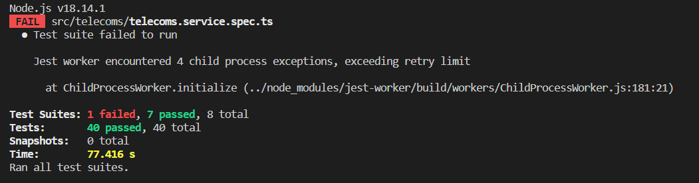
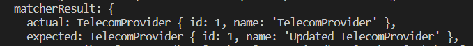
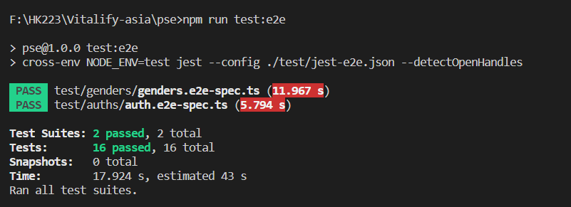

# Test - JEST
Jest là một framework kiểm thử (testing framework) phổ biến trong cộng đồng JavaScript và TypeScript. Nó được sử dụng để viết và chạy các bài kiểm tra (tests) cho ứng dụng và thư viện JavaScript/TypeScript.

Jest cung cấp các tính năng và công cụ để viết và chạy các bài kiểm tra tự động, như kiểm tra các hàm, components, modules và các phần khác của ứng dụng. Nó hỗ trợ viết các bài kiểm tra đơn giản và rõ ràng bằng cách sử dụng các hàm như describe, it và các matcher như expect để kiểm tra kết quả mong đợi.

## @nestjs/testing 
Với NestJS, Jest thường được sử dụng để viết các bài kiểm tra cho ứng dụng NestJS. Jest được tích hợp sẵn trong NestJS và cung cấp các utilitiy và decorator để viết bài kiểm tra dễ dàng hơn.

## Mock testing
### Định nghĩa
Mock testing là một phương pháp kiểm thử phần mềm trong đó các đối tượng phụ thuộc (dependencies) của một đối tượng hay hệ thống được giả lập (mock) để kiểm tra hành vi và tương tác của đối tượng đang được kiểm thử. Trong mock testing, các đối tượng thật được thay thế bằng các đối tượng giả lập, giúp kiểm tra các phần riêng lẻ của hệ thống mà không phụ thuộc vào các thành phần khác.

- Hãy quan sát ví dụ sau được lấy từ trong project:
```ts
// Define sample data
const createGenderDto: CreateGenderDto = {
  name: 'LGBT',
};

// Describle mock method
describe('GenderController', () => {
  let gendersController: GenderController;
  let gendersService: GendersService;

  beforeEach(async () => {
    const app: TestingModule = await Test.createTestingModule({
      controllers: [GenderController],
      providers: [
        GendersService,
        {
          provide: GendersService,
          useValue: {
            create: jest
              .fn()
              .mockImplementation((gender: CreateGenderDto) =>
                Promise.resolve({ id: '1', ...gender }),
              ),
          }
        }
      ]
    })
  });

  // Mock test 
  describe('create()', () => {
    it('should create a gender', async () => {
      const result = await gendersController.create(createGenderDto);
      expect(result).toEqual({ id: '1', ...createGenderDto });
      expect(gendersService.create).toHaveBeenCalledWith(createGenderDto);
    });
  });
})
```
Đây là một đoạn test mô tả mock test của class `GenderController`:
- Vì ở trong `GenderController` có sử dụng lớp `GendersService`, thay vì import lớp này vào và sử dụng thì ở đây chúng ta cần viết các giả định cho các method của `GendersService`.

```ts
provide: GendersService,
useValue: {
create: jest
    .fn()
    .mockImplementation((gender: CreateGenderDto) =>
    Promise.resolve({ id: 1, ...gender }),
    ),
}
```

Đoạn mã này mô tả method `create` của GendersService. Trong đó:
- Input: một đối tượng có kiểu `CreateGenderDto`
- Output: một đối tượng có thêm id và các dữ liệu còn lại đều giống với gender.
Đối chiếu với `GendersService`:
```ts
export class GendersService {
  constructor(
    @InjectRepository(Gender)
    private gendersRepository: Repository<Gender>,
  ) {}

  create(createGenderDto: CreateGenderDto): Promise<Gender> {
    return this.gendersRepository.save(
      this.gendersRepository.create(createGenderDto),
    );
  }
}
```
Đây được gọi các các mocktest, chúng mô tả lại hành vi của các phương thức nhằm mục đích kiểm thử một cách độc lập từng module. 
### Cấu hình
Để chạy các mock testing, chúng ta cần phải cấu hình cho jest:
```json
"jest": {
    "moduleFileExtensions": [
      "js",
      "json",
      "ts"
    ],
    "rootDir": "src",
    "testRegex": ".*\\.spec\\.ts$",
    "transform": {
      "^.+\\.(t|j)s$": "ts-jest"
    },
    "collectCoverageFrom": [
      "**/*.(t|j)s"
    ],
    "coverageDirectory": "../coverage",
    "testEnvironment": "node"
}
```
Có thể cấu hình trực tiếp trong `package.json`.

### Chạy test
Dự án này đã setup các scripts cần thiết cho việc chạy các mock tests:

```json
"scripts": {
    "test": "jest --maxWorkers=50%",
    "test:watch": "jest --watch --maxWorkers=25%"
}
```

1. Kết quả:


2. Phân tích kết quả: 
Kết quả trên cho thấy một test đã bị sai, cần kiểm tra lại.


## E2E testing
### Định nghĩa
E2E (End-to-End) testing là một loại kiểm thử phần mềm được thực hiện để kiểm tra tích hợp và tương tác giữa các thành phần và hệ thống khác nhau trong một ứng dụng, từ đầu đến cuối (end-to-end). Nó nhằm đảm bảo rằng toàn bộ quy trình hoạt động của ứng dụng, từ giao diện người dùng đến backend và cơ sở dữ liệu, đều hoạt động như mong đợi.

Hãy quan sát ví dụ sau đây, được lấy từ trong project:
```ts
it('Create [POST /genders]', async () => {
    await request(app.getHttpServer())
      .post('/genders')
      .set('Authorization', 'Bearer ' + token)
      .send(createGenderDto)
      .expect(201)
      .then(({ body }) => {
        expect(body).toBeDefined();
        expect(body.name).toBeDefined();
        expect(body.name).toEqual(createGenderDto.name);
      });
});
```

Đoạn code trên mô tả gọi API tạo thêm một bản ghi Gender mới. Trong đó:
- Route: `/genders`
- Method: `POST`
- Payload: createGenderDto
- Authorization: Bearertoken

Kết quả trả về của API trên sẽ có định dạng json như sau:
```json
{
    "id": 4,
    "name": "NewGender",
    "createdAt": "2023-07-07T09:09:55.000Z",
    "updatedAt": "2023-07-07T09:09:55.000Z",
    "deletedAt": null
}
```
Khi đó các hành vi kiểm thử tiếp theo được thêm vào:
- Kiểm tra http status code:
    ```ts
    expect(201)
    ```
- Kiểm tra body có dữ liệu trả về hay không:
    ```ts
    expect(body).toBeDefined();
    ```
- Sau đó là liên tiếp các thao tác kiểm tra dữ liệu của các trường có undefined hay không:
    ```ts
    expect(body.name).toBeDefined();
    expect(body.name).toEqual(createGenderDto.name);
    ```

### Cấu hình
1. Jest
Để chạy các e2e testing, chúng ta cần phải cấu hình cho jest:
```json
{
  "moduleFileExtensions": ["js", "json", "ts"],
  "rootDir": ".",
  "testEnvironment": "node",
  "testRegex": ".e2e-spec.ts$",
  "transform": {
    "^.+\\.(t|j)s$": "ts-jest"
  }
}
```
Các cấu hình trên được lưu vào file có tên là `jest-e2e.json`.
2. Test ENV
- Vì các e2e test sẽ phát sinh thay đổi dữ liệu khi thực thi, nên chúng ta cần một cơ chế để giải quyết điều này. Chia server thành các môi trường khác nhau như `PRODUCTION`, `TEST`, `DEV` là một giải pháp được sử dụng trong project này.

- Bằng cách sử dụng thư viện cross-env để thêm các biến môi trường trong khi chạy scripts sẽ giúp việc kiểm thử trở nên tiện lợi hơn:
```json
"scripts": {
  "test:e2e": "cross-env NODE_ENV=test jest --config ./test/jest-e2e.json --detectOpenHandles",
}
``` 

- Flag `--detectOpenHandles` được thêm vào để có thể đọc các thông báo được log ra ở tầng sâu hơn.
3. Database test
- Bằng cách phân biệt các môi trường sản phẩm bằng biến môi trường, chúng ta có thể cấu hình migrate, seeding dữ liệu và test một cách độc lập về mặt dữ liệu:

- Migrate:
```ts
import 'reflect-metadata';
import { DataSource, DataSourceOptions } from 'typeorm';

const isTestEnvironment = process.env.NODE_ENV == 'test';

const databaseUrl = isTestEnvironment
  ? process.env.TEST_DATABASE_URL
  : process.env.DATABASE_URL;
// ...
```

- Seeding dữ liệu:
```ts
const isTestEnvironment = process.env.NODE_ENV == 'test';
const runSeed = async () => {
  const app = await NestFactory.create(SeedModule);

  // ...
  await app.get(UserSeedService).run(isTestEnvironment);
  await app.close();
};
```

- E2E test:
```ts
// ...
import databaseConfig from './config/database.config';
import { ConfigModule } from '@nestjs/config';
import { TypeOrmModule } from '@nestjs/typeorm';
import { TypeOrmConfigService } from './database/typeorm-config.service';
import { DataSource, DataSourceOptions } from 'typeorm';

@Module({
  // ...
  // ENV configuration
  imports: [
    ConfigModule.forRoot({
      isGlobal: true,
      load: [databaseConfig, authConfig, appConfig],
      envFilePath: ['.env'],
    }),
    // ...
    // TypeORM configuration
    TypeOrmModule.forRootAsync({
      useClass: TypeOrmConfigService,
      dataSourceFactory: async (options: DataSourceOptions) => {
        return new DataSource(options).initialize();
      },
    }),
    // modules ...
  ],
})
export class AppModule {}
```

### Chạy các test
Dự án này đã setup các scripts cần thiết cho việc chạy các e2e tests:

```json
"scripts": {
    "test:e2e": "cross-env NODE_ENV=test jest --config ./test/jest-e2e.json --detectOpenHandles",
    "test:all": "npm run test && npm run test:e2e",
}
```
- Thời gian cho các test e2e sẽ tương đối lâu hơn mock test vì sẽ phải khởi động server và chạy các API thực tế.
- Kết quả

  

